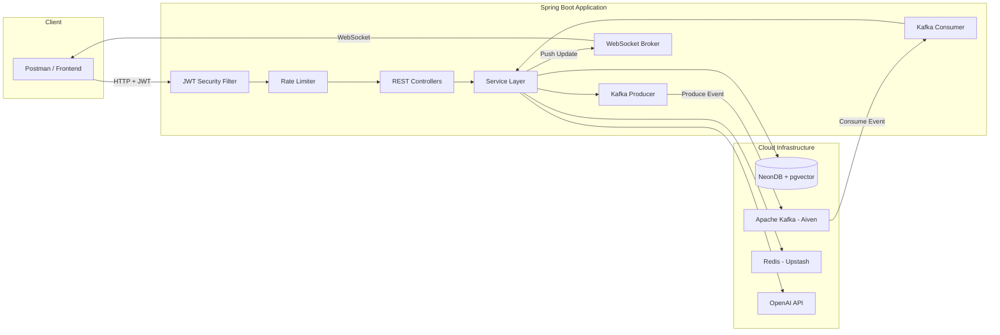

<p align="center">
  
  
  
  
  
  
</p>

# 🧠 SmartHire — AI-Powered Recruitment Platform

> An enterprise-grade backend system that uses **LLM-driven semantic matching**, **vector embeddings**, and **event-driven architecture** to intelligently connect recruiters with the most relevant candidates — in real time.

SmartHire is not a simple CRUD application. It is a production-ready recruitment intelligence platform that demonstrates mastery of distributed systems, AI integration, real-time communication, and cloud-native security patterns.

---

## 📋 Table of Contents

- [Architecture Overview](#architecture-overview)
- [Key Features](#key-features)
- [Tech Stack](#tech-stack)
- [System Architecture Diagram](#system-architecture-diagram)
- [API Endpoints](#api-endpoints)
- [AI Pipeline Deep Dive](#ai-pipeline-deep-dive)
- [Security Model](#security-model)
- [Getting Started](#getting-started)
- [Environment Variables](#environment-variables)
- [Project Structure](#project-structure)
- [API Workflow Walkthrough](#api-workflow-walkthrough)
- [License](#license)

---

<a id="architecture-overview"></a>
## 🏗 Architecture Overview

SmartHire follows a **layered, service-oriented architecture** built on Spring Boot 4.1, designed for horizontal scalability and clean separation of concerns:

```
Client Request
     │
     ▼
┌─────────────────────┐
│   Security Layer     │  JWT Authentication + Role-Based Access Control
│   (JwtFilter)        │  BCrypt Password Hashing
└────────┬────────────┘
         ▼
┌─────────────────────┐
│   Rate Limiting      │  Bucket4j Token Bucket Algorithm
│   (Interceptor)      │  Per-IP throttling on AI-heavy endpoints
└────────┬────────────┘
         ▼
┌─────────────────────┐
│   REST Controllers   │  AuthController, JobController, ProfileController, AdminController
└────────┬────────────┘
         ▼
┌─────────────────────┐
│   Service Layer      │  Business Logic + AI Orchestration
│                      │  AiMatchmakerService, ApplicationService, ProfileService
└────────┬────────────┘
         │
    ┌────┴─────┬──────────────┬──────────────┐
    ▼          ▼              ▼              ▼
┌────────┐ ┌────────┐ ┌───────────┐ ┌──────────────┐
│ NeonDB │ │ Kafka  │ │  Redis    │ │  OpenAI API  │
│ pgvec. │ │ Aiven  │ │  Upstash  │ │  GPT + Ada   │
└────────┘ └────────┘ └───────────┘ └──────────────┘
```

---

<a id="key-features"></a>
## ✨ Key Features

### 🤖 AI-Powered Candidate Matching (RAG Architecture)
- Resumes are parsed from PDF uploads, converted into **1536-dimensional vector embeddings** using OpenAI's `text-embedding-ada-002` model via LangChain4j, and stored in **PostgreSQL with pgvector**.
- When a recruiter searches for candidates, the job description is embedded into the same vector space and a **cosine similarity search** instantly retrieves the top matches — ranked by mathematical relevance, not keyword matching.
- Each match is then enriched by an **LLM evaluation pass** (GPT-5.4) that generates a human-readable summary explaining *why* the candidate fits and what skills they may be missing.

### 📄 Asynchronous Resume Processing (Event-Driven)
- Resume uploads are handled via an **Apache Kafka producer-consumer pipeline** (hosted on Aiven Cloud with SASL_SSL encryption).
- The API instantly returns `202 Accepted` to the user while a background Kafka consumer extracts text from the PDF (via Apache PDFBox), generates the embedding vector, and persists it to the database — **zero blocking on the main thread**.

### 🔔 Real-Time Notifications (WebSockets)
- Application status updates (e.g., `SHORTLISTED`, `REJECTED`, `INTERVIEW_SCHEDULED`) are pushed **instantly** to the candidate's browser via **STOMP over WebSocket** — no polling required.

### 📧 AI-Generated Communication
- Recruiters can auto-generate **personalized interview invitation emails** or **empathetic rejection emails** for any candidate, powered by GPT. Each email is contextually tailored based on the specific job description and the candidate's resume.

### ❓ AI-Generated Interview Questions
- For any shortlisted candidate, the system generates **3 highly customized interview questions** that target their specific strengths, skill gaps, and project experience relative to the job posting.

### 🛡️ Enterprise Security
- **JWT-based stateless authentication** with role-based access control (`CANDIDATE`, `RECRUITER`, `ADMIN`).
- **BCrypt password hashing** for all user credentials.
- **Rate limiting** via Bucket4j on AI-heavy endpoints to prevent abuse and control API costs.
- **Zero secrets in source code** — all credentials externalized via environment variables with a gitignored local config.

### 📊 Admin Analytics Dashboard
- A protected `/api/admin/metrics` endpoint aggregates platform-wide statistics (total users, jobs, applications) for system monitoring.

---

<a id="tech-stack"></a>
## 🛠 Tech Stack

| Layer | Technology | Purpose |
|---|---|---|
| **Framework** | Spring Boot 4.1 | Core application framework |
| **Language** | Java 17+ | Primary language |
| **Database** | PostgreSQL (Neon Cloud) + pgvector | Relational data + vector similarity search |
| **AI / LLM** | OpenAI GPT-5.4-mini | Match scoring, interview questions, email drafting |
| **Embeddings** | OpenAI text-embedding-ada-002 via LangChain4j | Resume & job vectorization |
| **Message Broker** | Apache Kafka (Aiven Cloud) | Async resume processing pipeline |
| **Caching** | Redis (Upstash) | Distributed caching layer |
| **Real-Time** | WebSocket (STOMP + SockJS) | Live application status push notifications |
| **Security** | Spring Security + JWT (jjwt) + BCrypt | Authentication & authorization |
| **Rate Limiting** | Bucket4j | Token bucket algorithm for API throttling |
| **PDF Parsing** | Apache PDFBox 3.0 | Resume text extraction |
| **API Docs** | SpringDoc OpenAPI (Swagger UI) | Interactive API documentation |
| **Build Tool** | Maven | Dependency management & build lifecycle |

---

<a id="system-architecture-diagram"></a>
## 🔀 System Architecture Diagram



---

<a id="api-endpoints"></a>
## 🔌 API Endpoints

### Authentication
| Method | Endpoint | Access | Description |
|---|---|---|---|
| `POST` | `/api/auth/register` | Public | Register a new user (CANDIDATE or RECRUITER) |
| `POST` | `/api/auth/login` | Public | Authenticate and receive a JWT token |

### Jobs
| Method | Endpoint | Access | Description |
|---|---|---|---|
| `POST` | `/api/jobs` | RECRUITER | Create a new job posting |
| `GET` | `/api/jobs` | Authenticated | List all available jobs |
| `POST` | `/api/jobs/{jobId}/apply` | CANDIDATE | Apply for a specific job (triggers AI scoring) |
| `GET` | `/api/jobs/{jobId}/applications` | RECRUITER | View all applicants for a job with AI match scores |
| `GET` | `/api/jobs/{jobId}/matches` | RECRUITER | Retrieve top 5 AI-matched candidates via pgvector |
| `PATCH` | `/api/jobs/applications/{id}/status` | RECRUITER | Update application status (triggers WebSocket push) |

### AI-Powered Endpoints
| Method | Endpoint | Access | Description |
|---|---|---|---|
| `POST` | `/api/jobs/match-candidates` | RECRUITER | Semantic search: find best candidates for a job description |
| `GET` | `/api/jobs/{jobId}/candidates/{id}/questions` | RECRUITER | Generate personalized interview questions |
| `GET` | `/api/jobs/{jobId}/candidates/{id}/email?type=INTERVIEW` | RECRUITER | Generate interview invitation email |
| `GET` | `/api/jobs/{jobId}/candidates/{id}/email?type=REJECTION` | RECRUITER | Generate empathetic rejection email |

### Profiles
| Method | Endpoint | Access | Description |
|---|---|---|---|
| `POST` | `/api/profiles` | CANDIDATE | Create or update candidate profile |
| `POST` | `/api/profiles/upload-resume` | CANDIDATE | Upload resume PDF (async Kafka processing) |

### Admin
| Method | Endpoint | Access | Description |
|---|---|---|---|
| `GET` | `/api/admin/metrics` | ADMIN | Platform-wide analytics and system metrics |

### Real-Time
| Protocol | Endpoint | Description |
|---|---|---|
| `WebSocket` | `/ws` | STOMP handshake endpoint (SockJS fallback) |
| `Subscribe` | `/topic/updates/{userId}` | Live application status notifications |

> 📖 **Full interactive API docs available at:** `http://localhost:8080/swagger-ui.html`

---

<a id="ai-pipeline-deep-dive"></a>
## 🧬 AI Pipeline Deep Dive

SmartHire implements a **Retrieval-Augmented Generation (RAG)** architecture for candidate matching:

```
                     ┌──────────────────────────────┐
                     │   1. INGESTION PHASE          │
                     │                                │
  Resume PDF ──────► │   PDFBox extracts text         │
                     │   LangChain4j generates        │
                     │   1536-dim embedding vector     │
                     │   Stored in pgvector column     │
                     └──────────────────────────────┘
                                   │
                                   ▼
                     ┌──────────────────────────────┐
                     │   2. RETRIEVAL PHASE           │
                     │                                │
  Job Description ─► │   Embed job into same space     │
                     │   Cosine similarity via SQL     │
                     │   Top-K candidates returned     │
                     │   (< 50ms, pure math)           │
                     └──────────────────────────────┘
                                   │
                                   ▼
                     ┌──────────────────────────────┐
                     │   3. GENERATION PHASE          │
                     │                                │
                     │   GPT evaluates each match     │
                     │   Generates human-readable     │
                     │   fit analysis per candidate    │
                     │   Interview Qs & Draft Emails   │
                     └──────────────────────────────┘
```

This is the same architectural pattern used by enterprise search engines and AI recruitment tools at scale.

---

<a id="security-model"></a>
## 🔐 Security Model

```
┌─────────────────────────────────────────────────────────┐
│                    SECURITY LAYERS                       │
├─────────────────────────────────────────────────────────┤
│                                                          │
│  1. AUTHENTICATION     JWT tokens (24h expiry)           │
│                        BCrypt password hashing           │
│                                                          │
│  2. AUTHORIZATION      Role-Based Access Control         │
│                        @PreAuthorize per endpoint         │
│                        CANDIDATE / RECRUITER / ADMIN      │
│                                                          │
│  3. RATE LIMITING      Bucket4j token bucket             │
│                        5 req/min on AI endpoints          │
│                        Per-IP tracking                    │
│                                                          │
│  4. TRANSPORT          SASL_SSL for Kafka                │
│                        SSL/TLS for Redis & PostgreSQL    │
│                                                          │
│  5. SECRETS MGMT       Zero hardcoded credentials        │
│                        Environment variable injection     │
│                        Gitignored local config files      │
│                                                          │
└─────────────────────────────────────────────────────────┘
```

---

<a id="getting-started"></a>
## 🚀 Getting Started

### Prerequisites

- **Java 17+** (OpenJDK recommended)
- **Maven 3.9+**
- **PostgreSQL** with [pgvector](https://github.com/pgvector/pgvector) extension (or use [Neon](https://neon.tech) serverless)
- **Apache Kafka** cluster (or use [Aiven](https://aiven.io) managed service)
- **Redis** instance (or use [Upstash](https://upstash.com) serverless)
- **OpenAI API Key** ([platform.openai.com](https://platform.openai.com))

### 1. Clone the Repository

```bash
git clone https://github.com/akash-suklabaidya/SmartHire.git
cd SmartHire
```

### 2. Configure Secrets

Create `src/main/resources/application-local.yml` (this file is gitignored):

```yaml
spring:
  datasource:
    password: <your-neondb-password>

openai:
  api:
    key: <your-openai-api-key>

# Redis (Upstash) Credentials
REDIS_HOST: <your-redis-host>
REDIS_PORT: 6379
REDIS_PASSWORD: <your-redis-password>

# Kafka (Aiven) Credentials
KAFKA_URL: <your-kafka-bootstrap-server>
KAFKA_USERNAME: <your-kafka-username>
KAFKA_PASSWORD: <your-kafka-password>

# JWT Signing Secret (min 32 chars)
JWT_SECRET: <your-jwt-signing-secret>
```

### 3. Build & Run

```bash
# Build the project
./mvnw clean install -DskipTests

# Run with local profile
./mvnw spring-boot:run -Dspring-boot.run.profiles=local
```

### 4. Access the API

- **API Base URL:** `http://localhost:8080`
- **Swagger UI:** `http://localhost:8080/swagger-ui.html`
- **WebSocket:** `ws://localhost:8080/ws`

---

<a id="environment-variables"></a>
## 🔑 Environment Variables

| Variable | Service | Description |
|---|---|---|
| `DB_PASSWORD` | NeonDB | PostgreSQL database password |
| `OPENAI_API_KEY` | OpenAI | API key for GPT and embedding models |
| `REDIS_HOST` | Upstash | Redis server hostname |
| `REDIS_PORT` | Upstash | Redis server port |
| `REDIS_PASSWORD` | Upstash | Redis authentication password |
| `KAFKA_URL` | Aiven | Kafka bootstrap server URL |
| `KAFKA_USERNAME` | Aiven | Kafka SASL username |
| `KAFKA_PASSWORD` | Aiven | Kafka SASL password |
| `JWT_SECRET` | Internal | JWT token signing secret |

---

<a id="project-structure"></a>
## 📁 Project Structure

```
src/main/java/com/backend/smarthire/
│
├── config/                          # Spring configuration classes
│   ├── AiConfig.java                # LangChain4j embedding model bean
│   ├── RedisConfig.java             # Redis connection configuration
│   ├── SecurityConfig.java          # Spring Security filter chain + RBAC
│   ├── SwaggerConfig.java           # OpenAPI 3.0 documentation setup
│   ├── WebConfig.java               # Rate limiter interceptor registration
│   └── WebSocketConfig.java         # STOMP WebSocket broker configuration
│
├── controller/                      # REST API endpoints
│   ├── AdminController.java         # System metrics (ADMIN only)
│   ├── AuthController.java          # Registration & login
│   ├── GlobalExceptionHandler.java  # Centralized error handling
│   ├── JobController.java           # Job CRUD + AI matching + email generation
│   └── ProfileController.java       # Candidate profiles + resume upload
│
├── dto/                             # Data Transfer Objects
│   └── ApiResponse.java             # Standardized API response wrapper
│
├── interceptor/                     # HTTP request interceptors
│   └── RateLimitInterceptor.java    # Bucket4j rate limiting enforcement
│
├── model/                           # Domain models
│   ├── Application.java             # Job application entity
│   ├── CandidateMatch.java          # AI match result DTO
│   ├── CandidateProfile.java        # Candidate profile entity
│   ├── Job.java                     # Job posting entity
│   └── User.java                    # User account entity
│
├── repository/                      # Data access layer (JdbcTemplate)
│   ├── AdminRepository.java         # Aggregate metrics queries
│   ├── ApplicationRepository.java   # Application CRUD + status management
│   ├── JobRepository.java           # Job CRUD + embedding storage
│   ├── ProfileRepository.java       # Profile CRUD + pgvector similarity search
│   └── UserRepository.java          # User CRUD + email lookup
│
├── security/                        # Authentication & authorization
│   ├── JwtFilter.java               # OncePerRequestFilter for JWT validation
│   └── JwtUtil.java                 # JWT token generation & parsing
│
├── service/                         # Business logic layer
│   ├── AiMatchmakerService.java     # OpenAI GPT + embedding orchestration
│   ├── ApplicationService.java      # Job application pipeline + WebSocket push
│   ├── JobService.java              # Job management + embedding generation
│   ├── ProfileService.java          # Resume parsing + embedding generation
│   ├── RateLimitingService.java     # Bucket4j bucket management
│   ├── ResumeEventConsumer.java     # Kafka consumer for async resume processing
│   ├── ResumeEventProducer.java     # Kafka producer for resume upload events
│   └── UserService.java             # User registration & authentication
│
└── SmarthireApplication.java        # Application entry point
```

---

<a id="api-workflow-walkthrough"></a>
## 🔄 API Workflow Walkthrough

Wondering how to actually use the platform? Here is the standard flow for both Candidates and Recruiters.

### 🧑‍💼 The Candidate Flow
1. **Register & Login**
   - `POST /api/auth/register` (Role: `CANDIDATE`)
   - `POST /api/auth/login` → Receive JWT token.
2. **Build Profile & Upload Resume**
   - `POST /api/profiles` → Create basic profile.
   - `POST /api/profiles/upload-resume` (Multipart/form-data) → Upload PDF resume. Kafka processes it asynchronously and generates vector embeddings.
3. **Find & Apply for Jobs**
   - `GET /api/jobs` → Browse available jobs.
   - `POST /api/jobs/{jobId}/apply` → Apply for a job. The system instantly calculates the AI match score against the job description and saves the application.
4. **Receive Real-Time Updates**
   - Connect to WebSocket `ws://localhost:8080/ws` and subscribe to `/topic/updates/{userId}`.
   - Instantly receive push notifications when the recruiter updates application status.

### 👔 The Recruiter Flow
1. **Register & Login**
   - `POST /api/auth/register` (Role: `RECRUITER`)
   - `POST /api/auth/login` → Receive JWT token.
2. **Post a Job**
   - `POST /api/jobs` → Post a new job. The system automatically generates a vector embedding for the job description.
3. **Review Applicants (AI Assisted)**
   - `GET /api/jobs/{jobId}/matches` → Fetches the top 5 most mathematically relevant candidates instantly using pgvector, enriched with a GPT-generated summary explaining *why* they fit.
4. **Prepare for the Interview**
   - `GET /api/jobs/{jobId}/candidates/{candidateId}/questions` → GPT generates 3 personalized interview questions targeting the candidate's specific skills and gaps.
5. **Communicate & Update Status**
   - `GET /api/jobs/{jobId}/candidates/{candidateId}/email?type=INTERVIEW` → GPT drafts a highly personalized interview invitation.
   - `PATCH /api/jobs/applications/{applicationId}/status` → Update status to `INTERVIEW_SCHEDULED`. This triggers a live WebSocket notification directly to the candidate's browser.

---

<a id="license"></a>
## 📄 License

This project is open source and available under the [MIT License](LICENSE).

---

<p align="center">
  Built with ☕ and 🧠 by <a href="https://github.com/akash-suklabaidya">Akash Suklabaidya</a>
</p>
